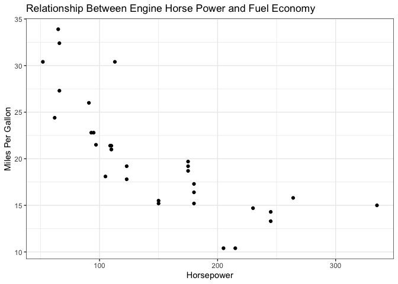

## GGPlot2

GGPlot2 is a data graphing and visualization library contained in the `tidyverse` package. GGPlot2 utilizes the grammar of graphics, and this [article](https://towardsdatascience.com/a-comprehensive-guide-to-the-grammar-of-graphics-for-effective-visualization-of-multi-dimensional-1f92b4ed4149) explains it very well. Let's go ahead and load in the `tidyverse` package.


```r
library(tidyverse)
```

GGplot2, or just GGPlot, is perhaps the most intuitive way to build powerful visualizations. For example, when we want to make a scatterplot, we need to supply our "grapher" with a few things. We need to tell it what data we're working with. We need to specify which variables go on each axis. We need to tell it if we want to add any coloring. We also want to tell it what the graph looks like, its theme. 

So, how do we do this with GGPlot? Let's look at an example.

## Scatterplot

For thsi graph we'll be making, we'll use the `mtcars` dataset. Let's look at some scatter plot code and break down each piece to understand what we're creating.


```r
mtcars %>% 
  ggplot(aes(x = hp, y = mpg)) +
  geom_point() +
  labs(x = "Horsepower", y = "Miles Per Gallon", title = "Relationship Between Engine Horse Power and Fuel Economy") +
  theme_bw()
```

<!-- -->

First, we name our data set and then a pipe (`%>%`). Then we call the `ggplot()` function from the `GGPlot2` library - this is what tells us we're creating a graph. Inside of `ggplot`, we name our aesthetics (`aes()`). This is where we tell the graph what goes on the X and Y axes. We also include lables for the axes and the title. Lastly, we specify the theme, what we want the stile of our graph to look like. There are countless more functions and parameters we can add to this chart, but this is all we'll learn about now. 

Now let's make a histogram.

## Bar Chart


```r
mtcars %>% 
  ggplot(aes(x = disp)) + 
  geom_histogram(binwidth = 5) + 
  labs(title = "Distribution of Car Displacement (in cubic inches)", x = "Displacement", y = "Count") +
  theme_bw() 
```

<!-- -->

Notice that even though we're creating a different kind of chart, but we follow the same process each time. Let's try making a boxplot.

## Boxplot


```r
mtcars %>% 
  ggplot(aes(x = cyl, y = mpg)) +
  geom_boxplot(aes(group = cyl)) +
  labs(x = "Number of Cylinders", y = "Miles Per Gallon", title = "Distribution of MPG by Cyl") +
  theme_bw()
```

<!-- -->


